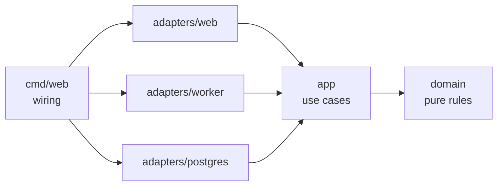

# Slotwise

Multi-tenant booking app for small service businesses — barbers, physios, tutors.
Customers book from a public page; owners and staff manage services, hours and bookings.

**Status: M1 complete** — schema, forced row level security, the tenant-scoped transaction
helper and both hard-requirement tests (cross-tenant isolation, one winner under
concurrency) are in. Scope and hard requirements live in [SPEC.md](SPEC.md); milestones and
exit criteria in [ROADMAP.md](ROADMAP.md); working rules in [AGENTS.md](AGENTS.md).

## Architecture



Dependencies point inward: `domain` imports stdlib only, `app` defines the store
interfaces it needs, adapters implement them, `cmd/web` wires the process.

## Requirements

- Go 1.26+ (the module's `go` directive; toolchain pinned in `go.mod`)
- Docker, for integration tests (Docker Desktop has to be running)

## Commands

| Command | What it does |
|---|---|
| `make check` | The gate: generate → fmt → lint → test → test-int → vuln → `go mod tidy -diff` |
| `make check-all` | Same gate with `-k`, so every failing stage is reported in one pass |
| `make test` / `make test-int` | Unit tests / Docker-backed integration tests (`-tags=integration`) |
| `make generate` | Codegen (sqlc, templ) — a no-op until their first inputs exist; `go tool goose` drives migrations |
| `make fmt`, `make lint`, `make vuln` | Single-purpose runs |

Tools are pinned in `go.mod` as Go tool directives and invoked as `go tool <name>`:
no global installs, identical versions locally and in CI.

## Database

Migrations in `migrations/` are append-only (CI rejects edits to existing files) and are
embedded in the binary, so tests and deploys apply exactly the committed SQL.

```sh
go tool goose -dir migrations postgres "$DATABASE_URL" up
```

The application connects as a non-owner role (`slotwise_app`) so row level security
actually applies; the role must exist before migrations run (they assert it, and grant it
table privileges). Every query runs inside `postgres.DB.WithTenant`, which sets
`app.tenant_id` for the transaction — with no tenant set, policies match zero rows. Booking
writes take the staff row lock first, so concurrent requests for one slot queue and the
exclusion constraint decides the winner. All of this is proven against a throwaway Postgres
in `make test-int`.

## Guardrails

- golangci-lint v2, 27 active linters and formatters: layering (`depguard`),
  `forbidigo` (no `time.Now`, `context.Background`, `panic`, `fmt.Print*`, `http.Error`
  outside `cmd/`), `wrapcheck`, `funlen`, `gocyclo`, `gosec`, gofumpt/goimports.
- `internal/arch` fails the build if an inner package imports an outer one, transitively.
- Migrations are append-only; CI rejects edits to existing files.
- Git hooks via [lefthook](https://github.com/evilmartians/lefthook): `brew install lefthook && lefthook install`
  gives a fast pre-commit (format check + lint of changed lines) and `make check` on push.
  Hooks are per-clone; CI runs the same gate regardless.
- `ci / check` must be green before merge. Markdown and license changes skip the heavy
  steps (the job still reports, so the required check is satisfied) — anything else runs
  the full gate.

## License

MIT — see [LICENSE](LICENSE).
