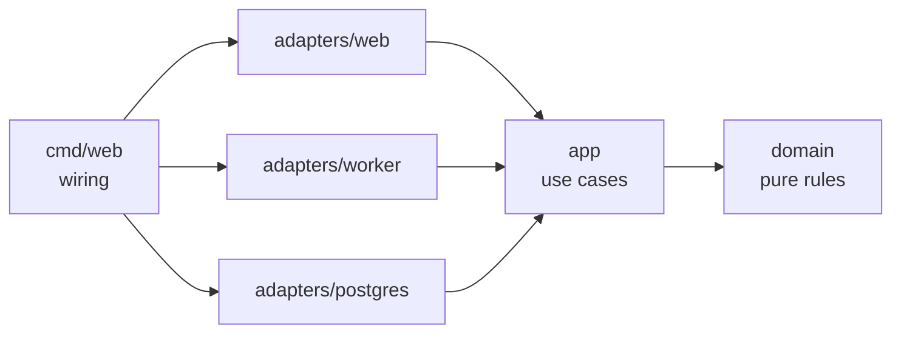

# Slotwise

Multi-tenant booking app for small service businesses — barbers, physios, tutors.
Customers book from a public page; owners and staff manage services, hours and bookings.

**Status: pre-M1 scaffold.** Scope and hard requirements live in [SPEC.md](SPEC.md);
milestones and exit criteria in [ROADMAP.md](ROADMAP.md); working rules in [AGENTS.md](AGENTS.md).

## Architecture

Dependencies point inward: `domain` imports stdlib only, `app` defines the store
interfaces it needs, adapters implement them, `cmd/web` wires the process.

## Requirements

- Go 1.25+ (toolchain pinned in `go.mod`)
- Docker, for integration tests

## Commands

| Command | What it does |
|---|---|
| `make check` | The gate: generate → fmt → lint → test → test-int → vuln → `go mod tidy -diff` |
| `make test` / `make test-int` | Unit tests / Docker-backed integration tests (`-tags=integration`) |
| `make generate` | sqlc, goose, templ — added in M1 |
| `make fmt`, `make lint`, `make vuln` | Single-purpose runs |

Tools are pinned in `go.mod` as Go tool directives and invoked as `go tool <name>`:
no global installs, identical versions locally and in CI.

## Guardrails

- golangci-lint v2, 27 active linters and formatters: layering (`depguard`),
  `forbidigo` (no `time.Now`, `context.Background`, `panic`, `fmt.Print*`, `http.Error`
  outside `cmd/`), `wrapcheck`, `funlen`, `gocyclo`, `gosec`, gofumpt/goimports.
- `internal/arch` fails the build if an inner package imports an outer one, transitively.
- Migrations are append-only; CI rejects edits to existing files.
- Git hooks via [lefthook](https://github.com/evilmartians/lefthook): `brew install lefthook && lefthook install`
  gives a fast pre-commit (format check + lint of changed lines) and `make check` on push.
  Hooks are per-clone; CI runs the same gate regardless.
- `ci / check` must be green before merge.
