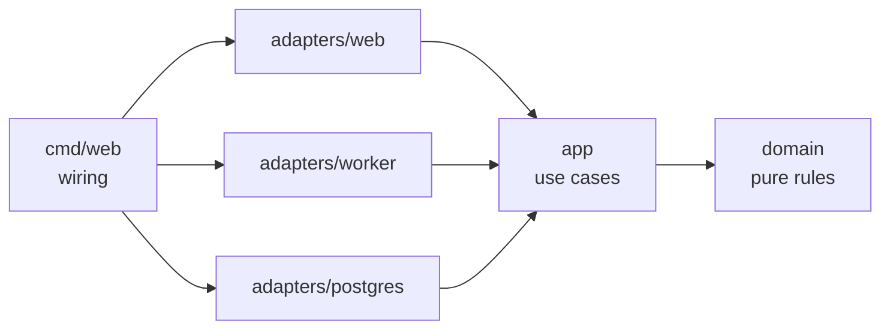

# Slotwise

Multi-tenant booking app for small service businesses — barbers, physios, tutors.
Customers book from a public page; owners and staff manage services, hours and bookings.

**Status: M4 complete.** M1's schema, forced row level security and tenant-scoped
transaction helper, M2's auth and owner/staff dashboard, M3's slot engine: weekly
availability rules, time off and service buffers feed a pure-domain search that returns
bookable starts for a local date range in the tenant's IANA timezone, with DST transitions
and half-open overlaps handled and tested against a real Postgres, and M4's booking flow:
idempotent public creates behind a signed cancel link, with the staff row lock and the
exclusion constraint picking exactly one winner under contention. Scope and hard
requirements live in [SPEC.md](SPEC.md); milestones and exit criteria in
[ROADMAP.md](ROADMAP.md); working rules in [AGENTS.md](AGENTS.md).

## Architecture



Dependencies point inward: `domain` imports stdlib only, `app` defines the store
interfaces it needs, adapters implement them, `cmd/web` wires the process.

## Requirements

- Go 1.26+ (the module's `go` directive; toolchain pinned in `go.mod`)
- Docker, for integration tests (Docker Desktop has to be running)

## Commands

| Command | What it does |
|---|---|
| `make check` | The gate: generate → fmt → lint → test → test-int → vuln → `go mod tidy -diff` |
| `make check-all` | Same gate with `-k`, so every failing stage is reported in one pass |
| `make test` / `make test-int` | Unit tests / Docker-backed integration tests (`-tags=integration`) |
| `make generate` | Codegen (sqlc now, templ in M6) from `queries/` and `migrations/`; `go tool goose` drives migrations |
| `make fmt`, `make lint`, `make vuln` | Single-purpose runs |

Tools are pinned in `go.mod` as Go tool directives and invoked as `go tool <name>`:
no global installs, identical versions locally and in CI.

## Database

Migrations in `migrations/` are append-only (CI rejects edits to existing files) and are
embedded in the binary, so tests and deploys apply exactly the committed SQL.

```sh
go tool goose -dir migrations postgres "$DATABASE_URL" up
```

The application connects as a non-owner role (`slotwise_app`) so row level security
actually applies; the role must exist before migrations run (they assert it, and grant it
table privileges). Every query runs inside `postgres.DB.WithTenant`, which sets
`app.tenant_id` for the transaction — with no tenant set, policies match zero rows. Booking
writes take the staff row lock first, so concurrent requests for one slot queue and the
exclusion constraint decides the winner. All of this is proven against a throwaway Postgres
in `make test-int`.

## Accounts and sessions

Logins are tenant-scoped at `/app/{slug}/login`: the same email can own two businesses, and
the tenant comes from the session rather than the URL once signed in. Passwords are
argon2id (m=19456, t=2, p=1, 12–128 bytes), sessions live in Postgres so a restart does not
sign anyone out, and the `sessions` table is unreachable for the application role — it is
read through `SECURITY DEFINER` functions, as is the slug resolver that has to work before
a tenant is known. Reset links are single-use, expire after an hour, and are stored as a
SHA-256 of the token; requesting one for an unknown email succeeds and sends nothing. Login
failures and reset requests are rate limited in memory (10 per 15 minutes, 5 per hour, per
account), so a single process must serve the traffic it is meant to throttle.

Migrations must therefore run as a superuser or a role with `BYPASSRLS`: the resolver
functions read tables that force row level security, and 0003 fails loudly if the migrating
role cannot. The first tenant and its owner are provisioned from the environment,
idempotently, on startup:

```sh
DATABASE_URL=... SLOTWISE_BASE_URL=https://slotwise.example \
SLOTWISE_CANCEL_SECRET=... \
SLOTWISE_BOOTSTRAP_SLUG=demo SLOTWISE_BOOTSTRAP_NAME="Demo Salon" \
SLOTWISE_BOOTSTRAP_TIMEZONE=Europe/Berlin \
SLOTWISE_BOOTSTRAP_OWNER_EMAIL=owner@example.com \
SLOTWISE_BOOTSTRAP_OWNER_PASSWORD=... go run ./cmd/web
```

A partial `SLOTWISE_BOOTSTRAP_*` group fails startup instead of quietly serving without a
tenant, and the slug has to stay clear of `services` and `staff`, which the router uses.
`SLOTWISE_COOKIE_SECURE=1` marks the session cookie `Secure`. Until M5 wires a real
provider, outbound mail — reset links included — goes to the log.

`SLOTWISE_CANCEL_SECRET` (at least 32 bytes) signs the public cancel links and is required:
the routes it protects are unauthenticated, so the token is the only credential they take.

## Booking

`GET /b/{slug}/slots?service=&from=&to=` lists bookable starts for one business, and
`POST /b/{slug}/bookings` books one. The create requires an `Idempotency-Key` header, with
the hidden form field as the browser fallback, and answers `303` with the booking's page as
its `Location`: `GET /b/{slug}/bookings/{id}?token=…` shows the booking and the form that
`POST /b/{slug}/bookings/{id}/cancel` cancels it. Replaying a key returns the booking it
already made — cancelled or not — instead of booking again, and cancelling twice succeeds.
Both public routes are rate limited in memory (10 creates per customer account and 60 per
business, 600 searches per business, per 15 minutes); the buckets are a guardrail against a
runaway client, not a denial-of-service defence.

## Guardrails

- golangci-lint v2, 27 active linters and formatters: layering (`depguard`),
  `forbidigo` (no `time.Now`, `context.Background`, `panic`, `fmt.Print*`, `http.Error`
  outside `cmd/`), `wrapcheck`, `funlen`, `gocyclo`, `gosec`, gofumpt/goimports.
- `internal/arch` fails the build if an inner package imports an outer one, transitively.
- Migrations are append-only; CI rejects edits to existing files.
- Git hooks via [lefthook](https://github.com/evilmartians/lefthook): `brew install lefthook && lefthook install`
  gives a fast pre-commit (format check + lint of changed lines) and `make check` on push.
  Hooks are per-clone; CI runs the same gate regardless.
- `ci / check` must be green before merge. Markdown and license changes skip the heavy
  steps (the job still reports, so the required check is satisfied) — anything else runs
  the full gate.

## License

MIT — see [LICENSE](LICENSE).
